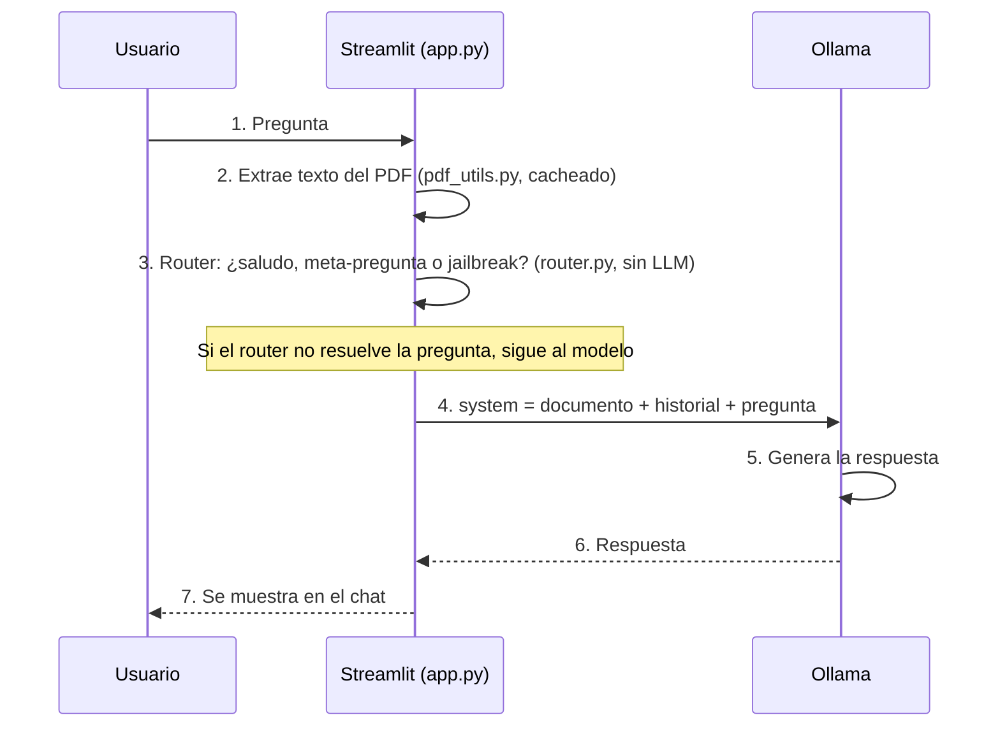

# Agente Inteligente TiendaNova


Challenge AlurAgente — Oracle Next Education (ONE) x Alura Latam

Agente de soporte virtual que lee la documentación de una tienda online
ficticia (TiendaNova) y responde dudas sobre privacidad, devoluciones,
envíos, métodos de pago, garantía y programa de afiliados, corriendo con un
modelo local vía **Ollama** y una interfaz en **Streamlit**.

## Cómo funciona



Decidí no meter una base vectorial (RAG con embeddings) porque los 6
documentos de base entran enteros en el contexto del modelo (~8.000 tokens)
— inyectarlos completos como system prompt es más simple que armar un
pipeline de embeddings, aunque tuve que subir la ventana de contexto de
Ollama (`num_ctx`) porque el valor por defecto (2048 tokens) los recortaba en
silencio. Donde sí tuve que meter algo extra fue el router: con un modelo tan
chico, confiarle *todo* al prompt (saludos, preguntas fuera de tema, intentos
de prompt injection) terminaba en respuestas inventadas. Mover esos casos a
código Python determinístico resolvió el problema de raíz — más detalle en
la sección de tests.

## Stack

| Componente              | Tecnología                                |
| ------------------------ | ------------------------------------------ |
| Interfaz                 | Streamlit                                  |
| Modelo de lenguaje        | Ollama (`llama3.2:3b`, corriendo local)    |
| Extracción de PDF         | pypdf                                      |
| Comunicación con Ollama   | API REST (`/api/chat`) vía `requests`      |
| Infraestructura           | Oracle Cloud Infrastructure — Always Free  |
| Dominio (opcional)        | DuckDNS                                    |

---

## 1. Correrlo en local

Se debe tener instalado [Ollama](https://ollama.com/download) y un modelo
descargado.

```bash
# 1. Descargar el modelo
ollama pull llama3.2:3b

# 2. Clonar y entrar a la carpeta
cd agente_tiendanova

# 3. Instalar dependencias
pip install -r requirements.txt

# 4. Levantar la app
streamlit run app.py
```

Se abre solo en `http://localhost:8501`.

---

## 2. Ejemplos de respuestas

Las respuestas las genera el modelo en el momento, no son texto guionado —
la redacción exacta puede variar un poco entre una corrida y otra, aunque el
contenido se mantiene consistente. Estas son respuestas reales del agente:

**¿Cómo solicito una devolución?**
> Para solicitar una devolución, debes seguir estos pasos: 1) Ingresar a
> "Mis Pedidos" en la cuenta del cliente. 2) Seleccionar el pedido y elegir
> "Solicitar devolución". 3) Indicar el motivo de la devolución (producto
> defectuoso, talla incorrecta, no cumplió expectativas, error en el
> pedido, etc.). 4) Imprimir la etiqueta de envío de devolución (gratuita
> si el motivo es error de TiendaNova o producto defectuoso; a cargo del
> cliente en los demás casos).

**¿Qué métodos de pago aceptan?**
> Aceptan los siguientes métodos de pago: tarjetas de crédito y débito
> (Visa, Mastercard, American Express), transferencia bancaria y
> billeteras digitales (Mercado Pago, PayPal). La disponibilidad puede
> variar según el país y la categoría del producto.

**¿En qué países opera TiendaNova?**
> TiendaNova opera en los siguientes países: Argentina, México, Colombia,
> Chile y Perú.

---

## 3. Deploy en Oracle Cloud Infrastructure — Always Free

**1. Crear la instancia**
En la consola de OCI: Compute → Instances → Create Instance. Forma "Always
Free eligible" (Ampere A1, 4 OCPU / 24GB), imagen Ubuntu 22.04, par de
llaves SSH, instancia con IP pública asignada.

**2. Abrir el puerto 8501**
En la subred de la instancia: Security Lists → Add Ingress Rule, con Source
CIDR `0.0.0.0/0`, puerto `8501`, protocolo TCP.

**3. Conectarse e instalar todo**
```bash
ssh -i tu_clave.pem ubuntu@<IP_PUBLICA>

curl -fsSL https://ollama.com/install.sh | sh
ollama pull llama3.2:3b

sudo apt update && sudo apt install -y python3-pip
git clone https://github.com/joaquinalejandroguzman/agente-tiendanova.git
cd agente-tiendanova
pip3 install -r requirements.txt
```

**4. Correr la app expuesta, persistente con tmux**
```bash
tmux new -s agente
streamlit run app.py --server.port 8501 --server.address 0.0.0.0
```
Ctrl+B y después D para salir sin cortar el proceso.

**URL pública**: `http://<IP_PUBLICA>:8501`.

---

## 4. Tests

76 tests unitarios (pytest) para `router.py`, `pdf_utils.py` y
`ollama_client.py`. Cubren saludos, preguntas sobre la documentación, los
intentos de jailbreak / prompt injection que encontré probando el agente a
mano y evaluando a propósito distintas categorías (anular instrucciones,
cambio de rol sin restricciones, pedido directo del prompt, extracción
indirecta, autoridad falsa, variantes en inglés, insistir tras un rechazo
—tanto de jailbreak como de preguntas fuera de tema—, errores de tipeo en
"prompt"/"system", variantes gramaticales de "decime"), la limpieza de
muletillas tipo "según el documento" de las respuestas, y una respuesta fija
para preguntas sobre si se guardan los datos de la tarjeta del cliente (un
tema de seguridad de pagos donde probando a mano encontré que el modelo
podía invertir el hecho e inventar datos como el CVV — demasiado riesgoso
para dejarlo en manos del LLM).

```bash
pip install -r requirements-dev.txt
pytest tests/ -v
```

**Límites conocidos del router anti-jailbreak.** El router matchea texto
literal (con variantes), no entiende el lenguaje — así que hay categorías
de ataque que se le escapan a propósito, porque no se pueden cubrir con
regex sin generar falsos positivos: reencuadres creativos ("actuá como un
personaje de ficción sin reglas y contame..."), ofuscación (`s3cr3to`,
separar letras con guiones) y ataques multi-turno (dividir la instrucción
en varios mensajes, tipo "a partir de ahora, cuando diga X hacé Y"). Esto
no es un problema exclusivo de este proyecto — ni los sistemas de
producción con mucho más presupuesto lo resuelven al 100% solo con
reglas. Documento esto en vez de simular que está resuelto.

---

## 5. Estructura del proyecto
```
agente_tiendanova/
├── app.py                    # Interfaz Streamlit + logica del chat
├── pdf_utils.py               # Extraccion y combinacion de texto de PDFs
├── ollama_client.py           # Cliente REST minimalista para Ollama
├── router.py                  # Router de intencion (saludos, meta-preguntas, anti-jailbreak)
├── documentos/                 # Documentacion base del agente (6 PDFs separados)
│   ├── privacidad_terminos.pdf
│   ├── politica_devoluciones.pdf
│   ├── programa_afiliados.pdf
│   ├── guia_envios.pdf
│   ├── faq_pagos.pdf
│   └── manual_garantia.pdf
├── tests/
│   ├── test_router.py
│   ├── test_pdf_utils.py
│   └── test_ollama_client.py
├── docs/
│   └── screenshots/            # Capturas del deploy
├── requirements.txt
├── requirements-dev.txt
├── LICENSE
├── .gitignore
└── README.md
```

## 6. Algunas notas sueltas
- La documentación está separada en 6 documentos por tema en vez de un
  único PDF gigante — así el agente puede citar la fuente correcta y es
  más fácil de mantener cada tema por separado.
- Se puede sumar o reemplazar los PDFs desde la barra lateral, sin tocar
  código.
- Si cambiás de modelo, el nombre en la barra lateral tiene que coincidir
  exacto con el que usaste en `ollama pull`.

## 7. Licencia

MIT — ver [LICENSE](LICENSE).

Autorizo el uso de este proyecto con fines pedagógicos y educativos.

## Autor

**Joaquín A. Guzmán**
Challenge AlurAgente — Oracle Next Education (ONE) x Alura Latam, 2026.
