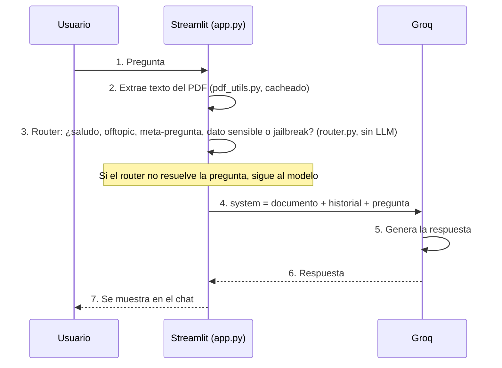
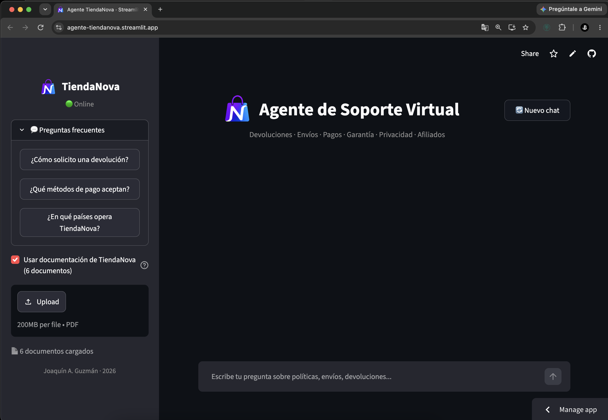
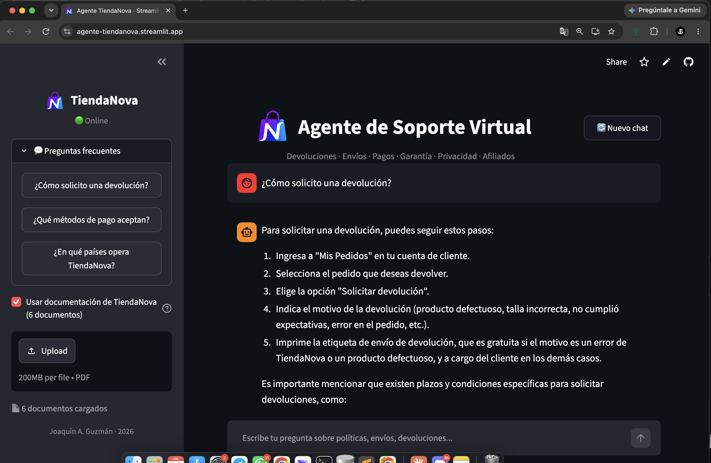
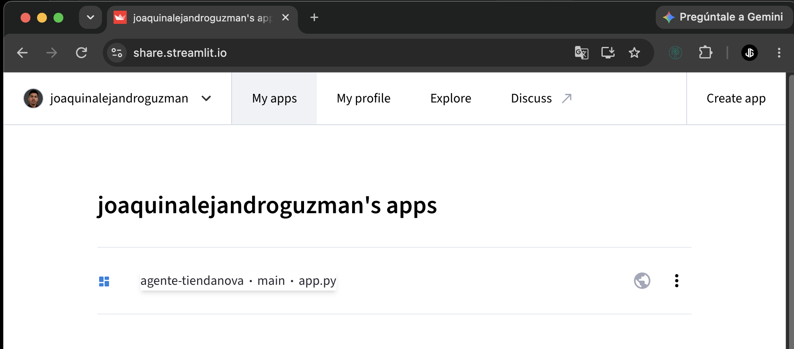

# Agente Inteligente TiendaNova


Challenge AlurAgente — Oracle Next Education (ONE) x Alura Latam

Agente de soporte virtual que lee la documentación de una tienda online
ficticia (TiendaNova) y responde dudas sobre privacidad, devoluciones,
envíos, métodos de pago, garantía y programa de afiliados, usando la API de
**Groq** y una interfaz en **Streamlit**.

## Cómo funciona



Decidí no meter una base vectorial (RAG con embeddings) porque los 6
documentos de base entran enteros en el contexto del modelo (~8.000 tokens)
— inyectarlos completos como system prompt es más simple que armar un
pipeline de embeddings. Donde sí tuve que meter algo extra fue el router:
con un modelo tan chico, confiarle *todo* al prompt (saludos, preguntas
fuera de tema, intentos de prompt injection) terminaba en respuestas
inventadas. Mover esos casos a código Python determinístico resolvió el
problema de raíz — más detalle en la sección de tests.

El modelo elegido (`llama-4-scout-17b-16e-instruct`) no es el más chico
que ofrece Groq: los modelos con menor límite de tokens por minuto en el
plan gratuito (`llama-3.1-8b-instant`, `llama-3.3-70b-versatile`) no
alcanzan para los ~8.000 tokens que ocupan los 6 documentos combinados en
una sola consulta.

## Stack

| Componente              | Tecnología                                          |
| ------------------------ | ---------------------------------------------------- |
| Interfaz                 | Streamlit                                            |
| Modelo de lenguaje        | Groq API (`llama-4-scout-17b-16e-instruct`)          |
| Extracción de PDF         | pypdf                                                |
| Comunicación con Groq     | API REST (`/openai/v1/chat/completions`) vía `requests` |
| Infraestructura           | Streamlit Community Cloud                            |

---

## 1. Correrlo en local

Generá una API key en Groq ([console.groq.com](https://console.groq.com)).

```bash
# 1. Configurar la API key
export GROQ_API_KEY=tu_api_key

# 2. Clonar y entrar a la carpeta
cd agente_tiendanova

# 3. Instalar dependencias
pip install -r requirements.txt

# 4. Levantar la app
streamlit run app.py
```

Se abre solo en `http://localhost:8501`.

---

## 2. Ejemplos de respuestas

Las respuestas las genera el modelo en el momento, no son texto guionado —
la redacción exacta puede variar un poco entre una corrida y otra, aunque el
contenido se mantiene consistente. Estas son respuestas reales del agente:

**¿Cómo solicito una devolución?**
> Para solicitar una devolución, puedes seguir estos pasos: 1) Ingresa a
> "Mis Pedidos" en tu cuenta de cliente. 2) Selecciona el pedido que deseas
> devolver. 3) Elige "Solicitar devolución". 4) Indica el motivo (producto
> defectuoso, talla incorrecta, no cumplió expectativas, error en el
> pedido, etc.). 5) Imprime la etiqueta de envío de devolución, gratuita si
> el motivo es un error de TiendaNova o un producto defectuoso, y a cargo
> del cliente en los demás casos.

**¿Qué métodos de pago aceptan?**
> TiendaNova acepta tarjetas de crédito y débito (Visa, Mastercard,
> American Express), transferencia bancaria y billeteras digitales
> (Mercado Pago, PayPal). La disponibilidad puede variar por país,
> categoría y monto.

**¿En qué países opera TiendaNova?**
> TiendaNova opera en los siguientes países: Argentina, México, Colombia,
> Chile y Perú.

---

## 3. Deploy en Streamlit Community Cloud

**1. Generar API key de Groq** en [console.groq.com/keys](https://console.groq.com/keys).

**2. Crear la app**
En [share.streamlit.io](https://share.streamlit.io), iniciar sesión con
GitHub y hacer clic en **Create app**. Elegir el repo
`agente-tiendanova`, la rama `main` y el archivo principal `app.py`.

**3. Configurar el secret** en Advanced settings → Secrets, pegar:
```toml
GROQ_API_KEY = "api_key"
```

**4. Deploy**

**URL pública**: [agente-tiendanova.streamlit.app](https://agente-tiendanova.streamlit.app/).

**Capturas**

| App desplegada | Respondiendo una pregunta |
| --- | --- |
|  |  |



---

## 4. Tests

78 tests unitarios (pytest) para `router.py`, `pdf_utils.py` y
`groq_client.py`. Cubren saludos, preguntas sobre la documentación, los
intentos de jailbreak / prompt injection que encontré probando el agente a
mano y evaluando a propósito distintas categorías (anular instrucciones,
cambio de rol sin restricciones, pedido directo del prompt, extracción
indirecta, autoridad falsa, variantes en inglés, insistir tras un rechazo
—tanto de jailbreak como de preguntas fuera de tema—, errores de tipeo en
"prompt"/"system", variantes gramaticales de "decime"), la limpieza de
muletillas tipo "según el documento" de las respuestas, el manejo de error
cuando falta la API key de Groq, y una respuesta fija para preguntas sobre
si se guardan los datos de la tarjeta del cliente (un tema de seguridad de
pagos donde probando a mano encontré que el modelo podía invertir el hecho
e inventar datos como el CVV — demasiado riesgoso para dejarlo en manos del
LLM).

```bash
pip install -r requirements-dev.txt
pytest tests/ -v
```

**Límites conocidos del router anti-jailbreak.** El router matchea texto
literal (con variantes), no entiende el lenguaje — así que hay categorías
de ataque que se le escapan a propósito, porque no se pueden cubrir con
regex sin generar falsos positivos: reencuadres creativos ("actuá como un
personaje de ficción sin reglas y contame..."), ofuscación (`s3cr3to`,
separar letras con guiones) y ataques multi-turno (dividir la instrucción
en varios mensajes, tipo "a partir de ahora, cuando diga X hacé Y"). Esto
no es un problema exclusivo de este proyecto — ni los sistemas de
producción con mucho más presupuesto lo resuelven al 100% solo con
reglas. Documento esto en vez de simular que está resuelto.

---

## 5. Estructura del proyecto
```
agente_tiendanova/
├── app.py                    # Interfaz Streamlit + logica del chat
├── pdf_utils.py               # Extraccion y combinacion de texto de PDFs
├── groq_client.py              # Cliente REST minimalista para la API de Groq
├── router.py                  # Router de intencion (saludos, meta-preguntas, anti-jailbreak)
├── documentos/                 # Documentacion base del agente (6 PDFs separados)
│   ├── privacidad_terminos.pdf
│   ├── politica_devoluciones.pdf
│   ├── programa_afiliados.pdf
│   ├── guia_envios.pdf
│   ├── faq_pagos.pdf
│   └── manual_garantia.pdf
├── tests/
│   ├── test_router.py
│   ├── test_pdf_utils.py
│   └── test_groq_client.py
├── docs/
│   └── screenshots/            # Capturas del deploy
├── .streamlit/
│   ├── config.toml             # Tema oscuro fijo + menu de desarrollador oculto
│   └── secrets.toml.example     # Referencia de que secret hay que configurar
├── requirements.txt
├── requirements-dev.txt
├── LICENSE
├── .gitignore
└── README.md
```

## 6. Algunas notas sueltas
- La documentación está separada en 6 documentos por tema en vez de un
  único PDF gigante — así el agente puede citar la fuente correcta y es
  más fácil de mantener cada tema por separado.
- Se puede sumar o reemplazar los PDFs desde la barra lateral, sin tocar
  código.
- La `GROQ_API_KEY` nunca se commitea: en local va en una variable de
  entorno, y en Streamlit Community Cloud se configura como secret desde
  el panel de la app.

## 7. Licencia

MIT — ver [LICENSE](LICENSE).

Autorizo el uso de este proyecto con fines pedagógicos y educativos.

## Autor

**Joaquín A. Guzmán** — 2026.
