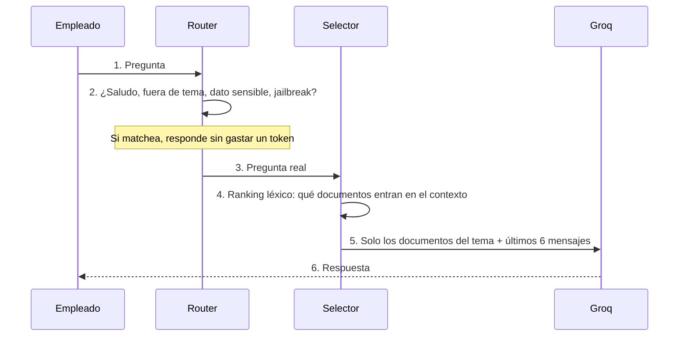

<div align="center">

# Cotejo

**Cada respuesta, contrastada con su fuente.**

[](https://www.python.org/)
[](https://streamlit.io/)
[](https://groq.com/)
[](#calidad)
[](LICENSE)

El equipo de una PyME le pregunta en criollo a la documentación interna de su empresa
—precios, stock, licencias, procedimientos— y obtiene la respuesta que está en sus
propios documentos. Sin inventar.

</div>

---

## El problema

En una PyME, el dueño es el cuello de botella. Lo interrumpen quince veces por día para
preguntarle lo mismo: cuánto sale el artículo 4021, si queda stock en el depósito, cuántos
días de licencia le quedan a alguien que entró en 2019, si una factura C de un
monotributista genera crédito fiscal.

Todas esas respuestas ya están escritas. El problema no es que falte la información: es
que está repartida entre un PDF de procedimientos, una planilla de precios en Excel y un
reglamento que nadie leyó completo.

## Qué hace Cotejo

Toma esos documentos, y contesta con lo que dicen. Nada más que con lo que dicen.

```
❓ ¿cuánto sale el bulto de yerba Rosamonte y cuántas unidades trae?
   → 10 unidades, $2.859,90

❓ me llegó una factura C de un monotributista, ¿me genera crédito fiscal?
   → No. Solo las facturas A de Responsables Inscriptos generan crédito
     fiscal computable. El importe total constituye costo.

❓ ¿cuánto sale el artículo 9999?
   → No encuentro el artículo 9999 en la lista de precios.
```

Esa última es la que importa. Con la lista de precios entera delante y un código que no
existe, **dice que no lo encuentra** en lugar de darte el precio del artículo de al lado.

---

## Cómo funciona



**Dos decisiones definen el sistema, y las dos son deliberadas.**

### El router resuelve sin LLM

Los saludos, las preguntas fuera de tema, las consultas sobre datos sensibles y los
intentos de prompt injection **no llegan al modelo**. Los resuelve código Python
determinista.

No es solo ahorro de tokens: un modelo chico al que se le confía todo al prompt termina
inventando. Mover esos casos a reglas explícitas los vuelve auditables y testeables — hay
más de 60 tests solo sobre el router.

### Recuperación léxica, sin base vectorial

Para un corpus de unos pocos documentos, un ranking léxico alcanza para elegir cuál
responde la pregunta, y evita arrastrar toda la infraestructura de un pipeline de
embeddings.

Esa decisión está **medida**, no supuesta. Ver abajo.

---

## Los resultados medidos

Esta es la parte que distingue al proyecto: no dice "anda bien", dice cuánto.

**54 preguntas** escritas como las hace un empleado real —elípticas, con jerga del rubro—
sobre un corpus de una distribuidora mayorista construido contra fuentes primarias: la
especificación del SEPA para las columnas, un catálogo mayorista real para los precios, y
el texto de la Ley de Contrato de Trabajo y del CCT 130/75 para las licencias.

```bash
python evaluacion/ejecutar.py
```

| Recuperador | Documento correcto recuperado |
| --- | --- |
| TF-IDF | **47/54 — 87%** |
| BM25 | **47/54 — 87%** |

**Empataron.** Y ese resultado negativo valió más que una mejora.

La literatura que respalda hacer recuperación léxica sin base vectorial habla siempre de
BM25, no de TF-IDF. Cambiar al estándar parecía obvio. Medirlo mostró que en este corpus
no cambia nada — y obligó a buscar la causa real:

```
Presupuesto de contexto: 14.000 caracteres

  stock_depositos.csv    14.471   (103%)  <-- no entra con ningún otro
  lista_precios.csv      13.903    (99%)  <-- no entra con ningún otro
  politica_licencias.pdf  6.226    (44%)
```

**Una sola planilla consume todo el presupuesto de contexto.** El cuello de botella no es
el algoritmo de ranking: es la granularidad. El sistema elige bien, pero entre unidades
del tamaño equivocado. Una lista de 77 artículos entra entera o no entra, cuando la
pregunta necesita **una fila**.

El análisis completo, con los siete fallos y qué se trajo en lugar de lo esperado, está en
**[`evaluacion/RESULTADOS.md`](evaluacion/RESULTADOS.md)**.

---

## Lo que lee

| Formato | Detalle |
| --- | --- |
| **PDF** | Procedimientos, políticas, reglamentos |
| **CSV** | Listas de precios, stock, cualquier planilla exportada |

La lectura de CSV contempla el caso argentino real: **separador `;` y encoding `cp1252`**,
que es lo que exporta Excel en configuración regional es-AR. También detecta la fila de
encabezado cuando la planilla trae el nombre de la empresa y una fecha arriba de la tabla,
y **preserva los decimales con coma** — `4350,50` no se convierte en `4350.5`.

---

## Correrlo

```bash
# 1. API key gratuita en https://console.groq.com/keys
export GROQ_API_KEY=tu_api_key

# 2. Instalar
make install

# 3. Levantar
make run
```

El modelo se resuelve por entorno, no está escrito en el código:

```bash
export GROQ_MODEL=openai/gpt-oss-120b   # opcional; es el valor por defecto
```

Esto no es un detalle. Groq da de baja modelos con fecha fija y **este proyecto se cayó dos
veces por eso**. Ahora, cuando dé de baja el próximo, alcanza con cambiar un secret y
reiniciar. Sin tocar código, sin redeploy.

Y para no enterarse por el cliente, un workflow verifica **todos los días** que el modelo
configurado siga vigente, activo y respondiendo. Si algo falla, llega un mail y se abre un
issue con el diagnóstico y la lista de reemplazos válidos.

---

## Calidad

Cinco compuertas, las mismas en tu máquina y en CI:

```bash
make lint          # ruff
make format-check  # ruff format
make typecheck     # mypy en modo estricto
make test          # 191 tests unitarios
make test-e2e      # Playwright contra un servidor Streamlit real
make check         # todas juntas
```

CI corre sobre **Python 3.12, 3.13 y 3.14**, más un job end-to-end que levanta Chromium
contra la app.

El desarrollo sigue **TDD estricto**: cada implementación viene precedida por su test en
rojo. Y hay un test que compara `requirements.txt` contra `pyproject.toml` y falla si
divergen, porque Streamlit Cloud instala del primero y una diferencia solo se manifestaría
en producción.

---

## Decisiones de diseño

Las que vale la pena contar, con su porqué.

**Sin filas coincidentes, no se manda ninguna fila.** Si se pregunta por un artículo que no
está en la planilla, el contexto lleva el esquema de la tabla y cero datos. Copiar la regla
de "si nada matchea, mandá los primeros" pondría frente al modelo filas con la forma exacta
de una respuesta válida —SKU, producto, precio— y lo empujaría a contestar con el precio de
otro artículo. La garantía es la **ausencia** de ese camino en el código, no una condición
que alguien pueda invertir.

**Los errores le hablan a dos audiencias distintas.** El empleado ve *"el asistente no está
disponible, el problema quedó registrado"*. El log recibe *"el modelo X ya no está
disponible en Groq (404), cargá uno nuevo en la variable GROQ_MODEL"*. Mezclarlos dejaba al
usuario leyendo nombres de variables de entorno y a quien mantiene el sistema sin enterarse
de nada.

**pandas queda detrás de una frontera tipada.** No trae `py.typed`, así que todos sus
símbolos son `Any` y con `warn_return_any` cualquier `return` suyo es un error. Todo cruza
por una función de cinco líneas que coacciona a `str` — y de paso eso preserva los
decimales con coma.

**El corpus de demostración no está todo actualizado a la misma fecha.** El reglamento
interno está fechado en 2022 y dice "AFIP" en vez de "ARCA". No es un descuido: es como son
los documentos de una PyME real, y genera el mejor caso de prueba del corpus — una pregunta
con una respuesta correcta en un documento y una plausible pero desactualizada en otro.

---

## Origen

Este proyecto nació como el **Challenge AlurAgente** de Oracle Next Education y Alura
Latam. Esa entrega está congelada y sigue navegable en el tag
**[`v1.0-challenge-alura`](../../releases/tag/v1.0-challenge-alura)**.

Lo que vino después cambió de objetivo: dejó de ser un agente de atención al cliente sobre
una tienda de demostración y pasó a ser una herramienta de consulta sobre la documentación
interna de una PyME.

---

<div align="center">

**Joaquín A. Guzmán** · Data & Business Analyst para PyMEs

[](https://www.linkedin.com/in/joaquinalejandroguzman/)

</div>
